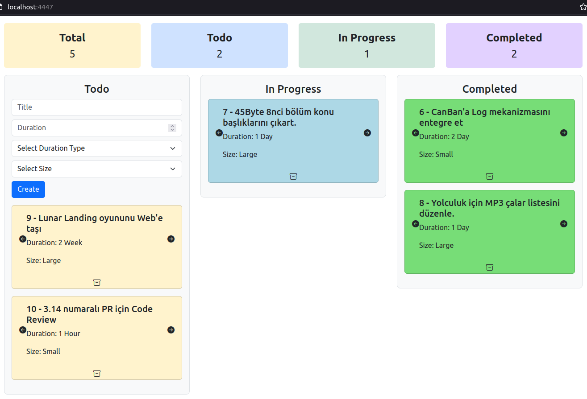
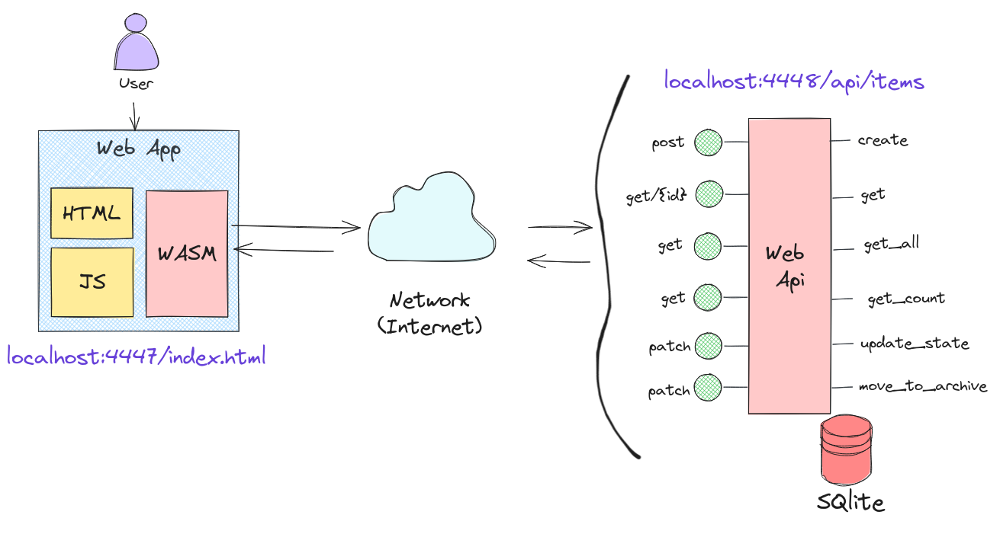

# Can-Ban Board

Youtube anlatımı...
[](https://www.youtube.com/watch?v=a6KVjYGon1c)

Rust tabanlı gündelik görevlerimizi yönetebileceğimiz deneysel bir web uygulamasıdır.(Sistem programcıları bana kızmasın :D) Önyüz tarafında WASM çıktıları, HTML ve basit Javascript kullanılmıştır. Backend tarafında REST tabanlı servis kullanımı söz konusudur. Basit olması açısından SQLite dosyası ile çalışmaktadır.



## Uygulama Özellikleri

- Uygulama tek seferde en fazla 5 görev olmasına izin verir.
- Görevler istenirse Arşive atılabilir.
- Görevler için süre belirlendikten sonra tahmini bitiş zamanı program tarafından otomatik olarak atanır.

## Eklenmesi Planlanan Özellikler veya İstekleriniz

- [ ] Arşive atılmış görevlerin tekrar Todo olarak eklenmesi.
- [ ] Board üstünde aynı anda bulunabilecek maksimum görev sayısının kullanıcı tarafından belirli kriterlere göre değiştirilebilmesi.
- [ ] Uygulamanın SQlite alternatifi bir veritabanı ile çalışacak hale getirilmesi.
- [ ] Docker Compose desteği eklenmesi.
- [ ] ...

## Developerlar İçin

Uygulamanın basit mimari modeli aşağıdaki gibidir. DotNet cephesindekiler için tanıdık olabilir. Özellikle Blazor tabanlı web çözümleri geliştirenler için. Burada da benzer bir yaklaşım söz konusu. Önyüz tarafındaki bazı operasyonlar, örneğin REST servis çağrıları WASM olarak derlenen Rust kütüphanesi üzerinden işletilmekte. Çağrılar backend tarafta çalışan REST servisine _(ki o da Rust ile yazılmıştır)_ ulaşır. İletişim development ortamda üretilmiş deneysel OpenSSL sertifikaları üzerinden icra edilmektedir.



Tüm çözüm tek Workspace altındaki birkaç projeden oluşmaktadır. Backend klasöründe REST Api görevini üstlenen servis uygulaması, Frontend klasöründe Rust ile birlikte HTML, Bootstrap ve Javascript kullanan web projesi bulunur. Hem backend hem de frontend projelerindeki rust kütüphanelerinin kullandığı ortak enstrümanlar da Shared altındaki rust projesinde toplanmıştır.

### WASM Tarafı

Bu projede wasm kullanıldığı için derleme işlemini yapan wasm-pack aracına ihtiyaç bulunmaktadır.

```bash
# wasm pack kurulumu için
cargo install wasm-pack

# WASM paketini hazırlamak için
wasm-pack build --target web
```

### Backend Tarafı

Backend servisi tipik bir Rest servisidir. Log çıktılarını görebilmek için aşağıdaki kullanım gerekebilir. Servis kullanımı için repodaki postman koleksiyonundan da yararlanılabilir.

```bash
RUST_LOG=info cargo run
```

### Sunucu Yayınlama

Frontend taraftaki rust tabanlı wasm uygulamasını host etmek için node.js ve express paketi kullanılmıştır.

```bash
# root klasördeyken
touch server.js

npm init -y

# Express modülü host işlemlerimizi kolaylaştırır
npm install express

# Frontend taraftaki örneği çalıştırmak için, yine root klasördeyken aşağıdaki komut kullanılabilir
npm start
```

### Alternatif Çalışma Zamanı

Projeler can-ban isimli workspace altında birleştirilmiştir. Web api tarafını ve ön yüzü birlikte ayağa kaldırmak için run.sh isimli terminal script'i kullanılabilir. 

```bash
# run.sh betiğini çalıştırılabilir hale getirmek için
sudo chmod +x run.sh

# Sonrasında çalıştırmak için
./run.sh
```

### HTTPS Desteği

Servis tarafına geliştirme safhasında SSL desteği sağlamak için bir openssl sertifikası kullanılmaktadır. Bunun için backend projesinde cert klasörü altında development amaçlı kullanılabilecek OpenSSL sertfikası üretilmiştir. Key.pem dosyasında private key, cert.pem dosyasında da örnek sertifika yer alır.

```bash
# Self-Signed Encrypted Private Key oluşturmak için
sudo openssl req -x509 -newkey rsa:4096 -keyout key.pem -out cert.pem -sha256 -days 365

# Benim sistemde dosya izinleri yetersizdi. Bu yüzden şu komutları çalıştırdım.
sudo chmod 644 key.pem cert.pem
```

Örnek projedeki sertifikalar hem backend servisinde hem de frontend tarafında ortaklaşa kullanılmaktadır. Buna istinaden servis ve node.js taraflarında da SSL kullanımı için gerekli kod değişiklikleri yapılmıştır.

Bu adımlardan sonra curl, postman veya browser'lardan https ile ilgili servis komutlarına erişim sağlanabilir.

### Notlar

- Web API tarafına ait testler için [postman_collection](postman_collection.json) Postman koleksiyonu kullanılabilir.